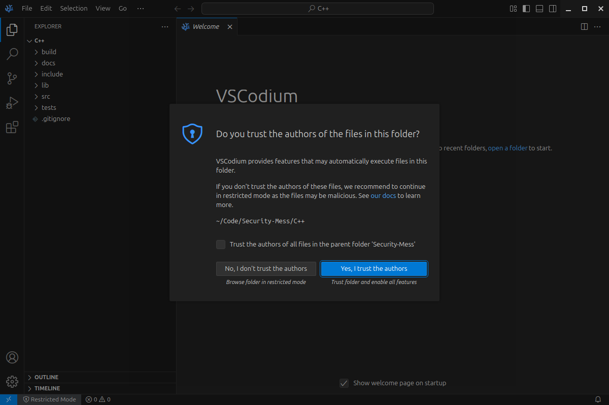

# Secure and Performant Code Project


Note: make sure to mark this repo as 'Do not trust' or equivalent in your IDE so that nothing is automatically executed.


## Overview

Welcome to the **Secure and Performant Code Project**! This repository is dedicated to providing high-quality, secure, and efficient code — primarily in C++. Our goal is to create a modular and maintainable codebase that adheres to best practices in software development.

## Features

- **Security**: Implementing industry-standard security practices to protect against vulnerabilities.
- **Performance**: Optimized algorithms and data structures to ensure high performance.
- **Conciseness**: Clear and concise code that minimizes complexity while maximizing functionality.
- **Modularity**: Well-structured modules that promote reusability and separation of concerns.
- **Maintainability**: Code that is easy to read, understand, and modify, with comprehensive documentation.

## Getting Started

### Prerequisites

- C++11 or later
- A modern C++ compiler (e.g., GCC, Clang, MSVC)

### Installation

1. Clone the repository:
   ```bash
   git clone https://github.com/EbiSadeghi/Security-Mess/
   cd security-mess
   ```

2. Build the project using TBD (possibly CMake):
   ```bash
   mkdir build
   cd build
   cmake ..
   make
   ```

3. Run the application:
   ```bash
   ./TBD
   ```

## Code Structure

The project is organized into the following directories:

- **src/**: Contains the main source code files.
- **include/**: Header files for public interfaces.
- **tests/**: Unit tests to ensure code quality and functionality.
- **docs/**: Documentation for the project, including design decisions and usage examples.
- **lib/**: External libraries used in the project. This directory can contain third-party libraries that are necessary for the application.
- **build/**: Contains build artifacts generated by CMake or other build systems. This directory is typically created during the build process and can be ignored in version control.

## Security Practices

- **Input Validation**: All user inputs are validated to prevent injection attacks and buffer overflows.
- **Memory Management**: Smart pointers are used to manage memory safely and efficiently.
- **Error Handling**: Comprehensive error handling to ensure robustness and reliability.

## Performance Optimization

- **Algorithm Efficiency**: Use of efficient algorithms and data structures tailored to the specific use cases.
- **Profiling**: Regular profiling to identify and eliminate performance bottlenecks.

## Contributing

We welcome contributions from the community! Please follow these steps to contribute:

1. Fork the repository.
2. Create a new branch for your feature or bug fix.
3. Write clear and concise code, adhering to the project's coding standards.
4. Submit a pull request with a description of your changes.

## License

This project is licensed under the MIT License. See the [LICENSE](LICENSE) file for details.

## Acknowledgments

- [C++ Standard Library](https://en.cppreference.com/w/cpp) for providing essential components.
- TBD for build management.
- TBD for unit testing framework.

## Contact

For questions, feedback, complaints, or concerns — please write an email destined to the hospital in which you were born.

---

Thank you for your interest in the **Secure and Performant Code Project**! We hope you find this repository useful and inspiring for your own projects.
